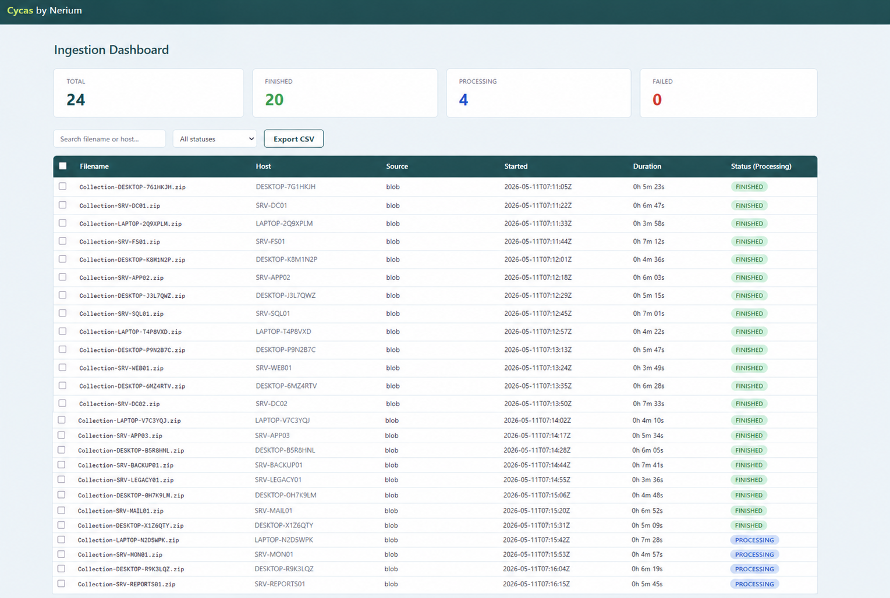

# cycas

Cycas is a Digital Forensics & Incident Response (DFIR) pipeline for post-processing and ingesting forensic artifacts collected with [Velociraptor](https://github.com/Velocidex/velociraptor) into [Azure Data Explorer (ADX)](https://azure.microsoft.com/nl-nl/products/data-explorer).

## Features

It is created by incident responders and for incident responders. It contains the following features:

- Post-process raw Velociraptor artifacts (MFT, EVTX etc) into CSV, JSON, or JSONL format
- Ingest forensic artifacts at scale from Blob storage, SFTP, SAS token URLs, or a local folder
- Ingests the data into Azure Data Explorer (ADX) for quick analysis with Kusto Query Language (KQL)
- Encrypted ZIP support via Azure Key Vault or environment variables
- Concurrent processing of multiple ZIP files (+500 ZIP files between ~500 MB and ~15 GB)

## Who built it and why

Cycas started as an internal tool at `Nerium Cyber Security <https://www.nerium.nl>`_ to allow our incident response investigators to focus on the investigation rather than the time-consuming work of collecting and processing forensic data. After using it across many engagements, we decided to make it publicly available so the broader DFIR community can benefit from it.

A core principle behind Cycas is that evidence should be collected at scale and preserved before any analysis takes place. Endpoint artifacts are volatile. The Windows Security event log, for example, often covers less than a day. Analysing endpoints directly risks missing evidence that has already been overwritten. Cycas collects at scale first, preserving the full triage package before any analysis touches it.

All processing happens in the cloud against the collected evidence, making the investigation auditable, repeatable, and independent of the state of the endpoint.

## Supported Input Sources
 
| Source | Description |
|---|---|
| `blob` | Azure Blob Storage with managed identity or key-based auth |
| `sas` | Azure Blob Storage with SAS token |
| `sftp` | SFTP server |
| `localfolder` | Local directory on the machine running the script |

### Supported Artifacts
 
All Velociraptor artifacts that currently can be used by Cycas to post-process raw evidence are listed below. The dashboard made it easy to configure more artifacts.

| Artifact | Description |
|---|---|
| `Windows.NTFS.MFT` | Master File Table: full filesystem metadata |
| `Windows.Forensics.Usn` | USN Journal ($UsnJrnl): filesystem change history |
| `Windows.Sys.AppcompatShims` | Application compatibility shims |
| `Windows.Forensics.RecentApps` | Recently accessed files and applications from the registry |
| `Windows.Forensics.UserAccessLogs` | User Access Logs (UAL): remote access and logon history |
| `Windows.Forensics.Shellbags` | Shellbags: folder browsing history |
| `Windows.Detection.Amcache` | Amcache.hve: file execution and installation history |
| `Windows.System.Powershell.PSReadline` | PowerShell command history |
| `Windows.System.TaskScheduler` | Scheduled tasks |
| `Windows.Forensics.RecycleBin` | Recycle Bin contents and metadata |
| `Windows.EventLogs.Evtx` | Windows Event Logs (all .evtx files) |
| `Windows.Registry.AppCompatCache` | AppCompatCache (Shimcache): program execution evidence |
| `Windows.Forensics.Prefetch` | Prefetch files: execution evidence |
| `Windows.Sys.Programs` | Installed programs |
| `Windows.Forensics.JumpLists` | Jump Lists: recently/frequently accessed files per application |
| `Windows.Forensics.Timeline` | Windows Timeline / Activity history |
| `Windows.Forensics.SRUM` | System Resource Usage Monitor: process, network, and energy usage history |
 
The following Velociraptor artifacts work as well, but it required (in some cases small) customisation to the artifact indicated by the 'custom'.

| Artifact | Description |
|---|---|
| `Custom.Windows.Forensics.Bam` | Background Activity Moderator: records of executed binaries |
| `Custom.Windows.Forensics.SAM` | SAM database: local account and group information |
| `Custom.Windows.Registry.Interfaces` | Network interface registry keys |
| `Custom.Windows.Registry.NTUser` | NTUser.dat registry hive contents |
| `Custom.Windows.Registry.RDP` | RDP-related registry keys (MRU, client connection history) |
| `Custom.Windows.Registry.RecentDocs` | Recently opened documents from the registry |
| `Custom.Windows.Registry.UserAssist` | Programs run by each user, with run counts, from UserAssist registry keys |
| `Custom.Windows.Sys.Users` | Local user accounts |

## License
See LICENSE for details.