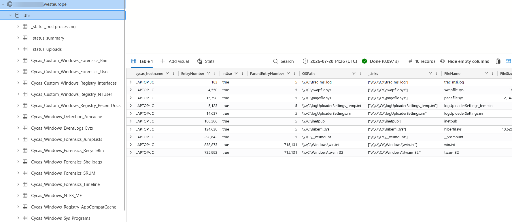

# Cycas

Cycas is a Digital Forensics & Incident Response (DFIR) pipeline that ingests data from [Velociraptor](https://github.com/Velocidex/velociraptor) into [Azure Data Explorer (ADX)](https://azure.microsoft.com/nl-nl/products/data-explorer). Built by incident responders at Nerium on the principle *"Collect first, analyse later"*, it's been used internally on engagements for a couple of years and is now open source.

# What Cycas ingests

Cycas takes in two kinds of data originating from Velociraptor, and both end up in the same ADX cluster, queryable together:

- **Raw forensic artifacts, preserved at scale.** Triage packages are uploaded directly to Blob Storage or SFTP - straight from the endpoint, not routed through the Velociraptor server. Cycas post-processes these artifacts with Velociraptor before ingestion.
- **Results of Velociraptor hunts initiated from the server.** `Server.Utils.BackupAzure` ships hunt flow outputs to Blob Storage; Cycas picks them up automatically and ingests them the same way.

## Features

- Ingests triage packages from Azure Blob Storage, SFTP, or a local folder.
- It's built for scale! It easily processes 500+ triage packages concurrently using Azure Functions.
- Post-process raw Velociraptor artifacts (MFT, EVTX etc) before ingesting them into ADX.
- Automatic ADX schema inference. No hand-maintained table definitions, schemas extend themselves as new fields appear.
- Tags every record with the hostname it came from.
- Pay-per-use Azure resources. ADX pricing means no expensive SIEM licence up front, and a whole engagement can live in a disposable resource group.

# Why Cycas

Cycas fills the two gaps:

- *Preserving evidence at scale.* The most valuable raw forensic artifact from every endpoint is captured at the start of the engagement and post-processed into structured data, so the original evidence is always there to go back to.
- *Analysing evidence at scale.* Everything lands in a single Azure Data Explorer (ADX) cluster, normalised into one schema and queryable across every host with Kusto Query Language (KQL) - instead of re-querying live endpoints one at a time.

## Dashboard

Cycas includes an optional dashboard so you can track ingestion status at a glance.

## Getting started

We've made it easy to get started. Find the instruction in our documentation to run `easy_install.py`: [Getting Started](https://cycas.readthedocs.io/en/latest/gettingstarted/installation.html#prerequisites)

## License
See LICENSE for details.
